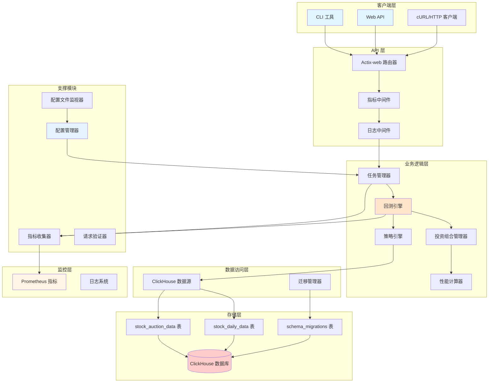
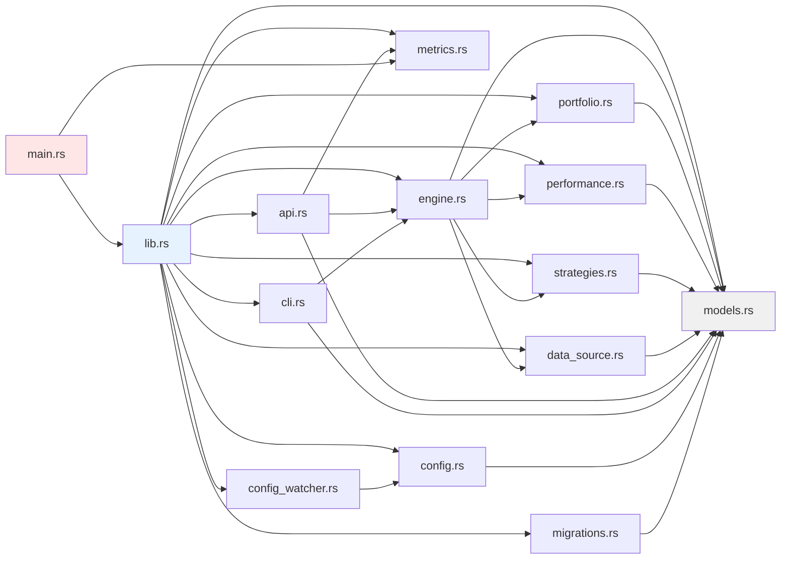
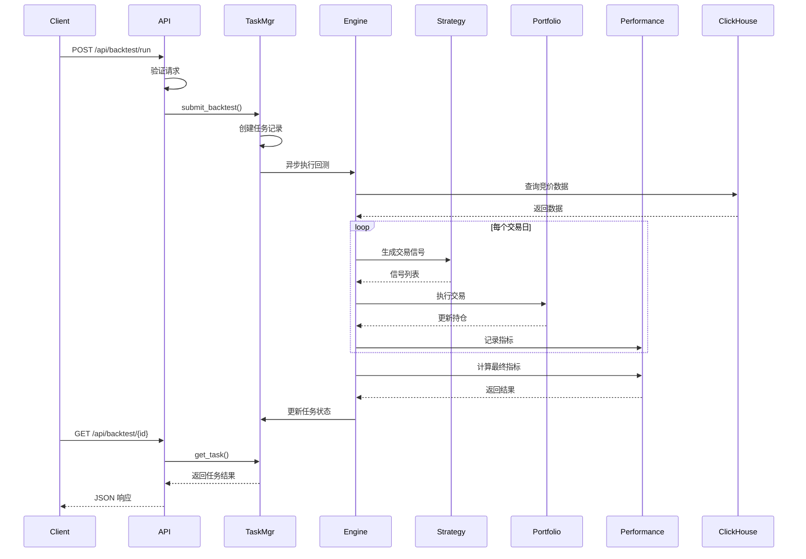
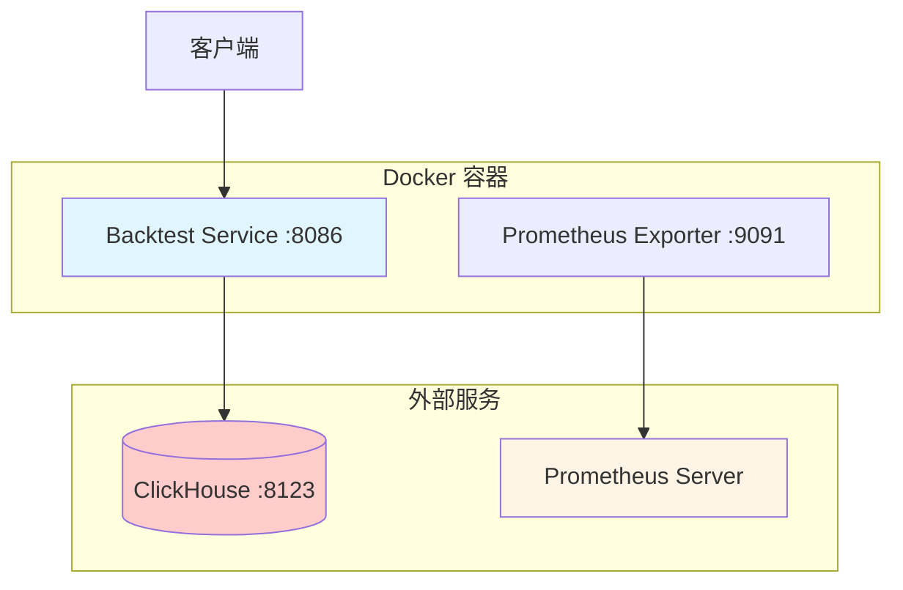

# Backtest Service 架构文档

## 项目概述

Backtest Service 是一个高性能的量化交易回测服务，基于 Rust 和 ClickHouse 构建，支持多种竞价策略的回测和评估。

## 架构图



## 模块依赖图



## 数据流图



## 目录结构

```
backtest-service/
├── src/
│   ├── main.rs              # 程序入口
│   ├── lib.rs               # 库入口
│   ├── models.rs            # 数据模型
│   ├── engine.rs            # 回测引擎
│   ├── portfolio.rs         # 投资组合管理
│   ├── performance.rs       # 性能指标计算
│   ├── strategies.rs        # 交易策略
│   ├── data_source.rs       # 数据源
│   ├── api.rs               # HTTP API
│   ├── cli.rs               # 命令行接口
│   ├── metrics.rs           # 指标收集
│   ├── config.rs            # 配置管理
│   ├── config_watcher.rs    # 配置热重载
│   └── migrations.rs        # 数据库迁移
├── migrations/              # 数据库迁移文件
│   ├── 001_create_stock_auction_data.sql
│   └── 002_create_stock_daily_data.sql
├── config/                  # 配置文件
│   └── development.toml
├── tests/                   # 集成测试
├── docs/                    # 文档
├── Cargo.toml               # Rust 依赖配置
├── Dockerfile               # Docker 镜像构建
├── docker-compose.yml       # Docker Compose 配置
└── Makefile                 # 构建脚本
```

## 核心组件说明

### 1. 回测引擎 (BacktestEngine)

- **职责**: 协调整个回测流程
- **功能**:
  - 从 ClickHouse 加载历史数据
  - 调用策略引擎生成信号
  - 执行交易并更新持仓
  - 计算性能指标

### 2. 策略引擎 (StrategyEngine)

- **职责**: 实现交易策略
- **支持的策略**:
  - 竞价龙头策略 (AuctionLeader)
  - 竞价封单策略 (AuctionSeal)
  - 盘中突破策略 (IntradayBreakout - 待实现)

### 3. 投资组合管理器 (PortfolioManager)

- **职责**: 管理资金和持仓
- **功能**:
  - 等权重买入
  - 持仓管理
  - 卖出执行
  - 权益更新

### 4. 性能计算器 (PerformanceCalculator)

- **职责**: 计算回测结果
- **指标**:
  - 收益率（总收益、年化收益）
  - 风险指标（最大回撤、波动率）
  - 交易统计（胜率、盈亏比、换手率）

### 5. 任务管理器 (TaskManager)

- **职责**: 管理异步回测任务
- **功能**:
  - 任务队列管理
  - 状态跟踪
  - 结果缓存

### 6. 数据源 (DataSource)

- **职责**: 与 ClickHouse 交互
- **功能**:
  - 查询竞价数据
  - 查询日线数据
  - 连接管理

## API 端点

| 方法 | 路径 | 说明 |
|------|------|------|
| GET | /health | 健康检查 |
| GET | /metrics | Prometheus 指标 |
| POST | /api/backtest/run | 启动回测 |
| GET | /api/backtest/{id} | 获取回测结果 |
| GET | /api/backtest/strategies | 获取策略列表 |
| GET | /api/backtest/history | 获取回测历史 |

## 配置项

### 数据库配置
- `clickhouse_url`: ClickHouse 连接地址
- `pool_size`: 连接池大小
- `query_timeout_secs`: 查询超时时间

### 服务配置
- `host`: 监听地址
- `port`: 监听端口
- `metrics_port`: Prometheus 指标端口

### 回测配置
- `max_backtest_days`: 最大回测天数
- `default_commission_rate`: 默认手续费率
- `min_initial_capital`: 最小初始资金
- `max_concurrent_tasks`: 最大并发任务数

## 部署架构



## 性能指标

### 暴露的指标

- `backtest_started_total`: 回测启动总数
- `backtest_completed_total`: 回测完成总数
- `backtest_failed_total`: 回测失败总数
- `backtest_duration_seconds`: 回测执行时间
- `http_requests_total`: HTTP 请求总数
- `http_request_duration_seconds`: HTTP 请求延迟
- `queue_pending_tasks`: 待处理任务数
- `queue_running_tasks`: 运行中任务数
- `queue_completed_tasks`: 已完成任务数

## 扩展点

### 添加新策略

1. 在 `strategies.rs` 中定义策略枚举
2. 实现 `Strategy` trait
3. 在 `StrategyEngine::generate_signals()` 中添加匹配逻辑

### 添加新指标

1. 在 `metrics.rs` 中定义指标函数
2. 在相应位置调用指标记录
3. 更新文档说明新指标的用途

### 添加新 API

1. 在 `api.rs` 中定义处理函数
2. 在 `main.rs` 中注册路由
3. 更新 API 文档

## 安全考虑

- 输入验证：所有 API 请求都经过严格验证
- SQL 注入防护：使用参数化查询
- 资源限制：限制最大回测天数和并发任务数
- 错误处理：完善的错误处理和日志记录

## 监控和运维

### 健康检查
- 端点: `GET /health`
- 返回: 服务状态

### 指标监控
- 端点: `GET /metrics` (服务端口)
- 端点: `http://localhost:9091/metrics` (Prometheus 端口)

### 日志
- 支持控制台输出
- 支持文件输出
- 可配置日志级别

### 配置热重载
- 自动检测配置文件变化
- 无需重启服务
- 延迟加载确保文件写入完成

## 测试

### 单元测试
- 26 个单元测试覆盖核心模块
- 测试覆盖:
  - 数据模型验证
  - 投资组合管理
  - 性能计算
  - 策略信号生成
  - 配置管理
  - 迁移工具

### 集成测试
- 端到端测试脚本
- Docker Compose 测试环境

## 性能优化

- 使用连接池减少数据库连接开销
- 异步任务处理提高并发能力
- 等权重买入简化计算
- ClickHouse 列式存储加速查询

## 未来规划

- [ ] 实现盘中突破策略
- [ ] 添加更多性能指标
- [ ] 支持多策略组合回测
- [ ] 添加前端可视化界面
- [ ] 支持实时数据回测
- [ ] 添加参数优化功能
