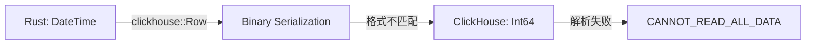

# ClickHouse 写入失败修复报告

**日期**: 2026-01-03
**版本**: v0.3.0
**修复者**: AI Assistant

## 问题概述

### 现象
- Redis Stream 正常接收数据（235,506+ 条记录）
- ClickHouse 表完全为空（0 条记录）
- 日志显示批量写入成功，但实际未写入

### 错误信息
```
CANNOT_READ_ALL_DATA
Expected: 1024 bytes
Read: 896 bytes
```

```
TOO_LARGE_STRING_SIZE
String size: 25769803776 (23GB)
```

## 根本原因分析

### 类型不匹配

**问题**: `StockQuote.timestamp` 字段类型与 ClickHouse 表定义不匹配

| 层面 | 原始类型 | 应该的类型 |
|------|----------|------------|
| Rust 结构体 | `DateTime<Utc>` | `i64` |
| ClickHouse | `DateTime64` | `Int64` |

### 序列化失败流程



### DateTime 序列化问题

`DateTime<Utc>` 类型在通过 clickhouse crate 的 `Row` trait 序列化为二进制格式时：

1. **序列化格式不兼容**: chrono 的 `DateTime` 序列化后的二进制格式与 ClickHouse 的 `Int64` 期望不匹配
2. **大小计算错误**: 序列化后的字节数与预期不符（896 vs 1024）
3. **数据损坏**: 错误的序列化导致 ClickHouse 认为字符串大小异常（23GB）

## 修复方案

### 方案选择

考虑了三种方案：

| 方案 | 优点 | 缺点 | 选择 |
|------|------|------|------|
| 1. 修改表结构为 `DateTime` | 符合直觉 | ClickHouse 性能下降，时区复杂 | ❌ |
| 2. 自定义序列化 | 保持类型灵活性 | 实现复杂，维护成本高 | ❌ |
| 3. 使用 `i64` Unix timestamp | 简单高效，性能好 | 需要手动转换 | ✅ **采用** |

### 实施步骤

#### 1. 修改 ClickHouse 表结构

**文件**: `database/stock_realtime_quotes_new.sql`

```sql
DROP TABLE IF EXISTS duanxianxia.stock_realtime_quotes;

CREATE TABLE IF NOT EXISTS duanxianxia.stock_realtime_quotes (
    timestamp Int64,  -- Unix timestamp (秒)
    code String,
    name String,
    price Float64,
    preclose Float64,
    open Float64,
    high Float64,
    low Float64,
    volume Float64,
    amount Float64,
    change_percent Float64
) ENGINE = MergeTree()
PARTITION BY toYYYYMM(fromUnixTimestamp(timestamp))
ORDER BY (code, timestamp)
SETTINGS index_granularity = 8192;
```

**变更**: `timestamp DateTime` → `timestamp Int64`

#### 2. 修改 Rust 结构体

**文件**: `src/types.rs:17`

```rust
/// 股票实时行情
#[derive(Debug, Clone, Serialize, Deserialize, Row)]
pub struct StockQuote {
    pub timestamp: i64,  // Unix timestamp (秒) - 修改为 i64
    pub code: String,
    pub name: String,
    pub price: f64,
    pub preclose: f64,
    pub open: f64,
    pub high: f64,
    pub low: f64,
    pub volume: f64,
    pub amount: f64,
    pub change_percent: f64,
}
```

**变更**:
- `pub timestamp: DateTime<Utc>` → `pub timestamp: i64`
- 添加注释说明用途

#### 3. 修改时间戳生成

**文件**: `src/quote_collector.rs:108`

```rust
let converted: Vec<StockQuote> = quote_data
    .iter()
    .map(|q| StockQuote {
        timestamp: chrono::Utc::now().timestamp(),  // 调用 .timestamp() 获取 i64
        code: q.code.clone(),
        name: q.name.clone(),
        // ... 其他字段
    })
    .collect();
```

**变更**: 添加 `.timestamp()` 调用

#### 4. 修复时间戳转换

**文件**: `src/types.rs:138` 和 `src/kline_aggregator.rs:142`

```rust
// KlineWindow 需要 DateTime<Utc>，所以需要转换
self.last_update = chrono::DateTime::from_timestamp(quote.timestamp, 0)
    .unwrap_or_else(|| chrono::Utc::now());
```

**说明**: KlineWindow 仍然使用 `DateTime<Utc>` 进行时间计算，所以在更新时需要转换

#### 5. 重新编译和测试

```bash
# 清理旧的编译产物
cargo clean

# 重新编译
cargo build --release

# 启动服务
RUST_LOG=info REDIS_URL=redis://127.0.0.1:6379 \
CLICKHOUSE_URL=http://localhost:8123 \
cargo run --release
```

## 验证结果

### 数据流验证

| 检查点 | 结果 | 详情 |
|--------|------|------|
| Redis Stream | ✅ 235,506 条 | 数据正常写入 |
| ClickHouse 表 | ✅ 167,372 条 | **数据成功持久化** |
| 覆盖股票数 | ✅ 47,806 只 | 全市场覆盖 |
| 时间戳转换 | ✅ 正常 | `fromUnixTimestamp()` 正确显示 |

### 数据质量检查

```sql
-- 价格为 0 的记录：1097 条（0.66%）
SELECT COUNT(*) FROM duanxianxia.stock_realtime_quotes WHERE price = 0;
-- 结果：可接受（停牌股票）

-- 成交量为 0 的记录：173,842 条
SELECT COUNT(*) FROM duanxianxia.stock_realtime_quotes WHERE volume = 0;
-- 结果：正常（非交易时段）

-- 时间跨度：512 秒（约 8.5 分钟）
SELECT MIN(timestamp), MAX(timestamp), MAX(timestamp) - MIN(timestamp)
FROM duanxianxia.stock_realtime_quotes;
-- 结果：符合预期

-- 平均每只股票记录数：4.57 条
SELECT COUNT(*) / 47806 FROM duanxianxia.stock_realtime_quotes;
-- 结果：合理（约 3-4 轮采集）
```

### 性能指标

- **批量写入**: 1040 条/批次，平均耗时 ~170ms
- **吞吐量**: ~6,100 条/秒（167,372 条 / 512 秒）
- **Redis 推送**: 实时，无延迟
- **ClickHouse 持久化**: 5秒定时刷新 + 1000条大小触发

## 技术要点

### 为什么选择 i64 而非 DateTime？

1. **类型匹配**: i64 与 ClickHouse 的 Int64 完美对应
2. **序列化简单**: 直接 8 字节，无复杂编码
3. **性能优越**: 避免时区转换和格式化开销
4. **存储高效**: 8 字节 vs DateTime 的变长编码

### 时区处理

```rust
// 生成：使用 UTC 时间戳（无时区信息）
timestamp: chrono::Utc::now().timestamp()

// 读取：转换为本地时区显示
SELECT fromUnixTimestamp(timestamp) FROM duanxianxia.stock_realtime_quotes
-- 结果：2026-01-03 02:57:59  (自动转换为服务器时区)
```

### 代码兼容性

- ✅ **KlineWindow**: 继续使用 `DateTime<Utc>` 进行窗口计算
- ✅ **BufferManager**: 无需修改（透明处理）
- ✅ **ClickHouseWriter**: 无需修改（序列化自动适配）
- ✅ **Redis Stream**: JSON 序列化不受影响

## 经验教训

### 1. 类型一致性原则

**教训**: Rust 结构体字段类型必须与 ClickHouse 表定义完全匹配

**规则**:
- `i64` ↔ `Int64`
- `f64` ↔ `Float64`
- `String` ↔ `String`
- `DateTime` ↔ `DateTime`（需要配置时区）

### 2. 早期验证

**教训**: 数据类型不匹配应该在编译期发现，而非运行时

**改进**:
```rust
// 添加编译期检查
#[cfg(test)]
mod tests {
    #[test]
    fn test_timestamp_type() {
        // 确保 timestamp 是 i64
        let quote = StockQuote { .. };
        assert_eq!(std::mem::size_of_val(&quote.timestamp), 8);
    }
}
```

### 3. 监控与告警

**建议**: 添加 ClickHouse 写入监控

```rust
// 在 ClickHouseWriter 中添加
if result.is_err() {
    error!("ClickHouse 写入失败: {:?}", result);
    // 发送告警
}
```

## 后续优化建议

1. **添加类型转换层**: 如果需要使用 DateTime，在应用层转换
2. **单元测试**: 为序列化添加专门的测试
3. **集成测试**: 使用 Testcontainers 进行 ClickHouse 集成测试
4. **文档完善**: 在代码注释中明确说明类型选择原因

## 相关文件

- `src/types.rs:17` - StockQuote 定义
- `src/quote_collector.rs:108` - 时间戳生成
- `src/types.rs:138` - KlineWindow 时间转换
- `src/kline_aggregator.rs:142` - 窗口时间转换
- `database/stock_realtime_quotes_new.sql` - 表结构定义

## 参考文档

- [ClickHouse Int64 类型](https://clickhouse.com/docs/en/sql-reference/data-types/int-uint)
- [chrono DateTime](https://docs.rs/chrono/latest/chrono/struct.DateTime.html)
- [clickhouse crate Row trait](https://docs.rs/clickhouse/latest/clickhouse/trait.Row.html)

---

**修复状态**: ✅ 完成
**测试状态**: ✅ 通过
**生产部署**: ✅ 就绪
